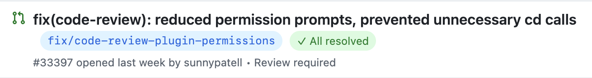
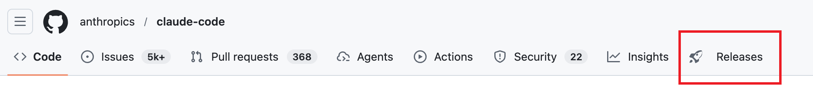

# Better GitHub

A Chrome extension that enhances GitHub's UI with practical features.

Inspired by [Refined GitHub](https://github.com/refined-github/refined-github) — a great extension, but some bugs linger unfixed (e.g. the Releases tab) and certain feature requests go unaddressed due to scope control. Better GitHub fills those gaps.

Another motivation: Refined GitHub has too many features tightly coupled to GitHub's DOM, which breaks frequently as GitHub updates its UI. By keeping the feature set small and preferring the GitHub API over DOM manipulation, Better GitHub stays maintainable long-term.

## Features

- **PR Branch Names** — Display source branch name next to each PR title. Click to copy.

  

- **PR Review Status** — Show review thread resolution status (resolved / unresolved) on the PR list. Only appears on PRs that have review threads; PRs without any review comments won't show a badge. Requires a GitHub token.
- **Releases Tab** — Add a Releases tab to the repository navigation bar.

   

All features can be individually toggled on/off in the extension options.

## Install

1. Clone the repo and install dependencies:

   ```sh
   pnpm install
   pnpm build
   ```

2. Open `chrome://extensions`, enable **Developer mode**, click **Load unpacked**, and select the `dist` folder.

## Configuration

Right-click the extension icon → **Options**:

- **GitHub Token** — A **classic** personal access token for private repos and review status. Needs `repo` scope. [Create one here](https://github.com/settings/tokens) (fine-grained tokens are not supported). Token is validated on blur.
- **Feature Toggles** — Enable or disable each feature individually. Changes take effect immediately without refreshing.
