# Better GitHub

[English](README.md) | [中文](README_CN.md)

[](https://chromewebstore.google.com/detail/better-github/annimelofpkbcphbdikipjlconehbnpb)

A Chrome extension that enhances GitHub's UI with practical features.

Inspired by [Refined GitHub](https://github.com/refined-github/refined-github) — a great extension, but some bugs linger unfixed (e.g. the Releases tab) and certain feature requests go unaddressed due to scope control. Better GitHub fills those gaps.

Another motivation: Refined GitHub has too many features tightly coupled to GitHub's DOM, which breaks frequently as GitHub updates its UI. By keeping the feature set small and preferring the GitHub API over DOM manipulation, Better GitHub stays maintainable long-term.

> **Note:** GitHub frequently A/B tests UI changes and offers additional toggles in Feature Preview. Features that depend on unstable or frequently changing DOM structures are unlikely to be added, to keep this project at a manageable complexity.

## Features

### Home

- **Better Top Repositories** — Auto-expand the "Top repositories" sidebar list and pin your favorite repos to the top. Works on the dashboard, feed page, and navigation drawer.

   <details>
      <summary>Screenshot</summary>
      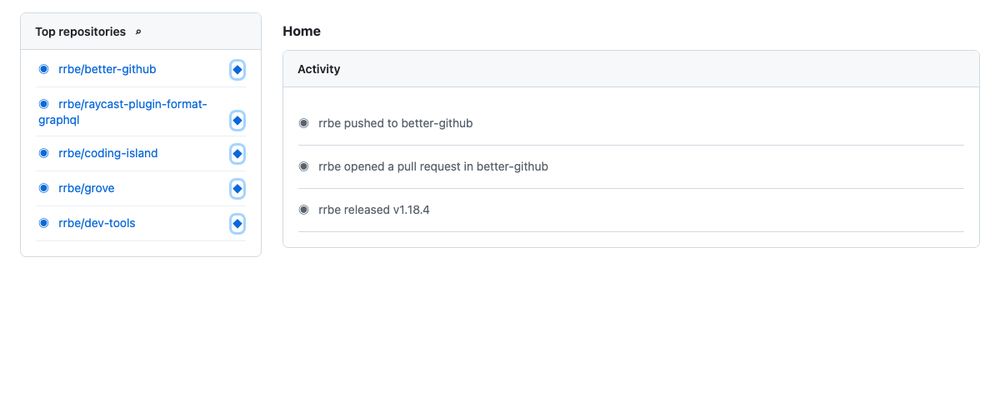
   </details>

### PRs and issues

- **Default Sort by Updated** — Sort PR and issue lists by recently updated instead of GitHub's default creation time order. No more missing active PRs buried on page 2.

   <details>
      <summary>Screenshot</summary>
      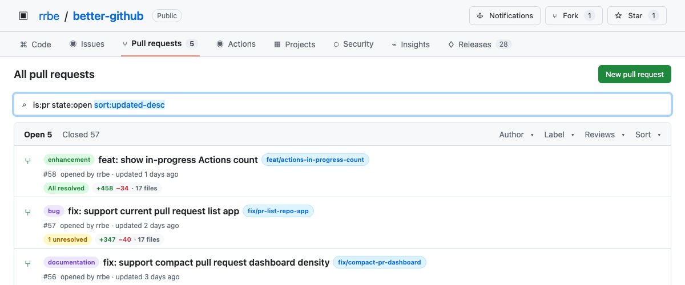
   </details>

- **PR Branch Names** — Display source branch name next to each PR title. Click to copy.

   <details>
      <summary>Screenshot</summary>
      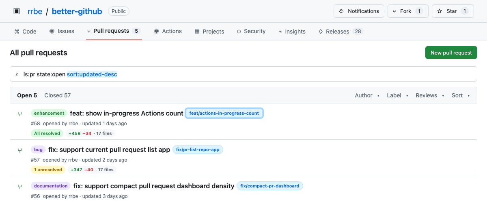
   </details>

- **PR Review Status** — Show review thread resolution status (resolved / unresolved) on the PR list. Only appears on PRs that have review threads; PRs without any review comments won't show a badge. Draft PRs are also excluded.

   <details>
      <summary>Screenshot</summary>
      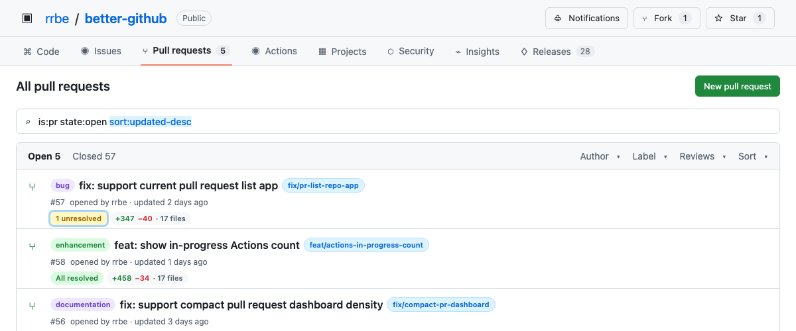
   </details>

- **PR Diff Stats** — Show additions, deletions, and changed file count (e.g. `+223 −114 · 5 files`) on each row of the PR list. Requires a token.

   <details>
      <summary>Screenshot</summary>
      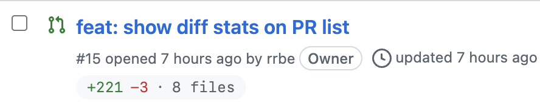
   </details>

- **PR Label Position** — Move labels to the front of PR titles for better visibility and scanning.

   <details>
      <summary>Screenshot</summary>
      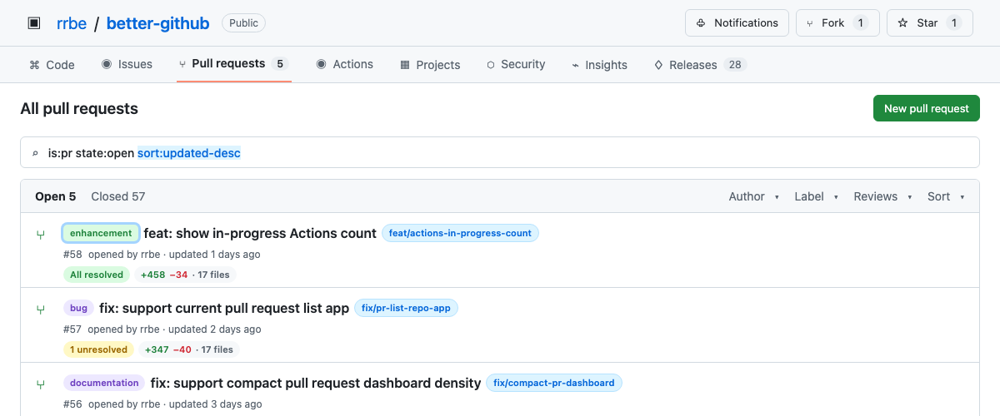
   </details>

### PR details

- **PR Approve Now** — Add an "approve now" shortcut to the Reviewers sidebar on PR detail pages for quick approval. Requires a token.

   <details>
      <summary>Screenshot</summary>
      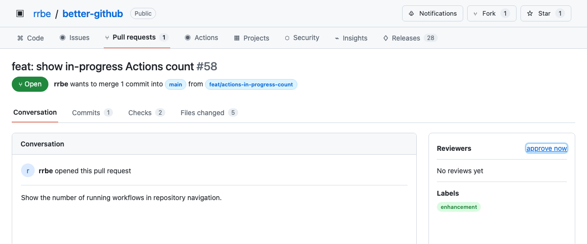
   </details>

- **Collapse/Expand All Files** — Add buttons to the diff toolbar to collapse or expand all file diffs in one click, plus a button inside the file tree to collapse or expand all folders. Works on PR, commit, and compare pages, and compatible with both the old and the new "Files changed" experience.

   <details>
      <summary>Screenshot</summary>
      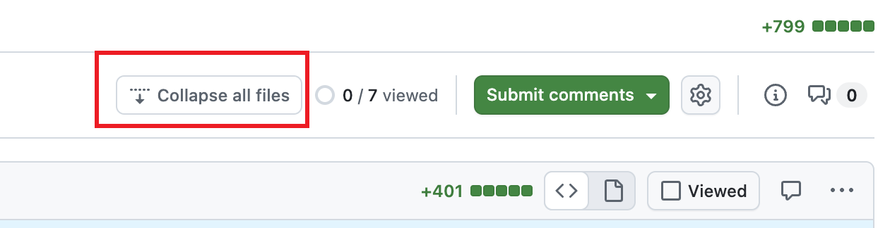
      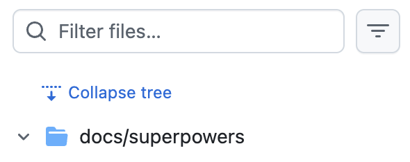
   </details>

### Commits

- **Commit Tags** — Show git tags as badges on the commits list page, so you can instantly see which commits are tagged releases.

   <details>
      <summary>Screenshot</summary>
      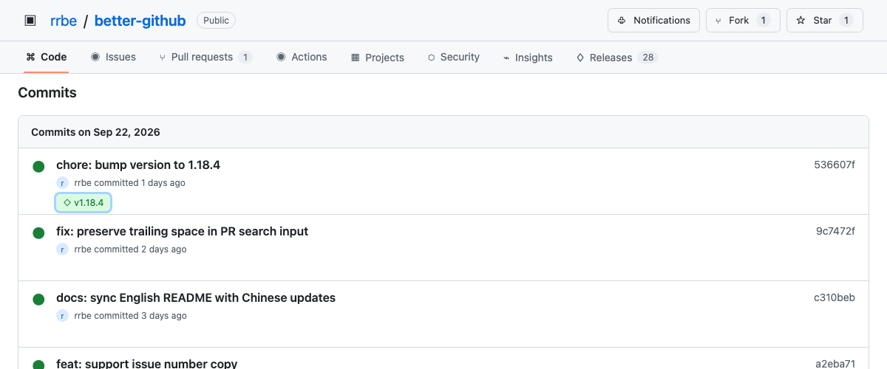
   </details>

- **Commit Diff Stats** — Show additions, deletions, and changed file count (e.g. `+223 −114 · 5 files`) on each row of the commits list page. Requires a token.

   <details>
      <summary>Screenshot</summary>
      
   </details>

### Repository

- **Releases Tab** — Add a Releases tab to the repository navigation bar for quick access.

   <details>
      <summary>Screenshot</summary>
      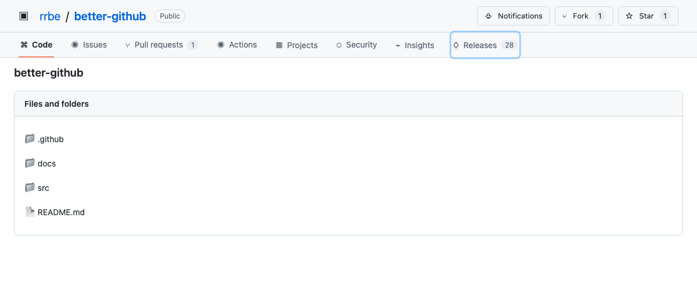
   </details>

- **Watch/Fork/Star Popup** — Hover over the Watch, Fork, or Star counts on a repo page to preview the full list of watchers, forks, or stargazers in a popup, with "View all" links to the full pages. Results are cached for 5 minutes to minimize API calls.

   <details>
      <summary>Screenshot</summary>
      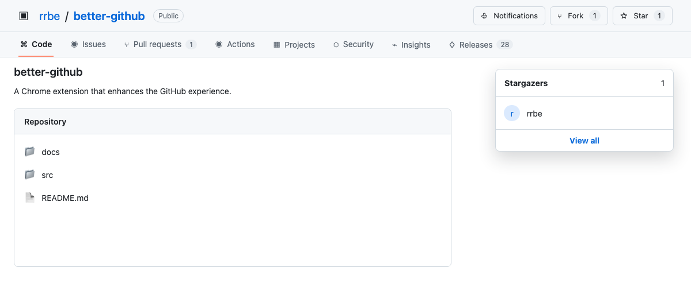
   </details>

- **Recent Commit Message Color** — Highlight recent commits with color based on their age, making it easy to spot the latest changes. Always on.

   <details>
      <summary>Screenshot</summary>
      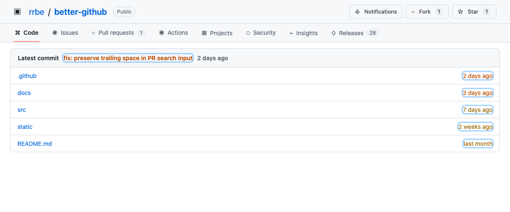
   </details>

All features except Recent Commit Message Color can be individually toggled on/off in the extension options.

## Build from Source

1. Clone the repo and build:

   ```sh
   pnpm install
   pnpm build
   ```

2. Open `chrome://extensions`, enable **Developer mode**, click **Load unpacked**, and select the `dist` folder.

## Install from Chrome Web Store

[Chrome Web Store - Better GitHub](https://chromewebstore.google.com/detail/better-github/annimelofpkbcphbdikipjlconehbnpb)

## Configuration

Right-click the extension icon → **Options**:

- **GitHub Token** — A **classic** personal access token for private repos and review status. Needs `repo` scope. [Create one here](https://github.com/settings/tokens).
- **Feature Toggles** — Enable or disable each feature individually. Changes take effect immediately.
