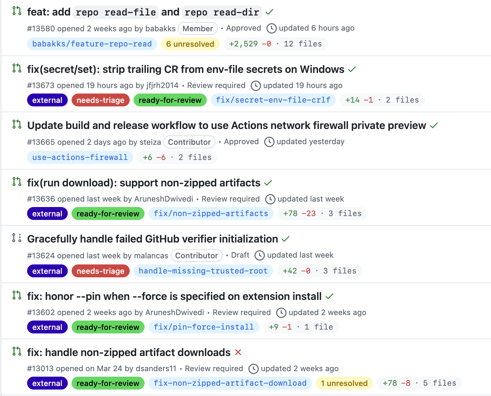
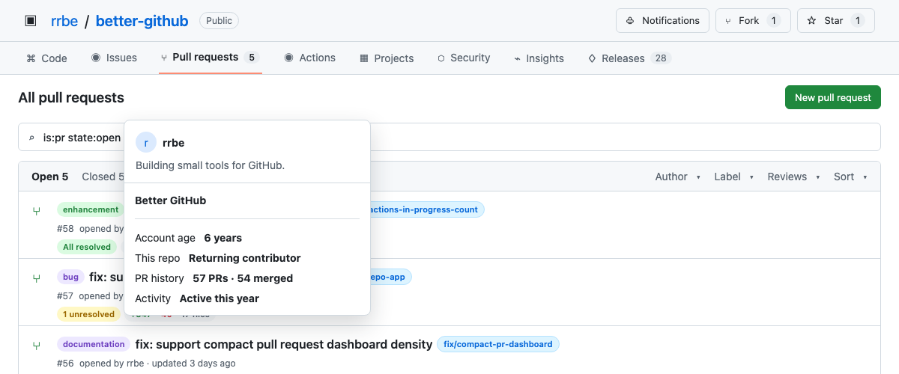

# Better GitHub

[English](README.md) | [中文](README_CN.md)

[](https://chromewebstore.google.com/detail/better-github/annimelofpkbcphbdikipjlconehbnpb)

Better GitHub is a Chrome extension that enhances the GitHub experience. Inspired by [Refined GitHub](https://github.com/refined-github/refined-github), but with hundreds of fiddly toggles trimmed away. It stays lightweight and focuses on the experience improvements that matter, so it's maintainable for the long haul.

**Open source and zero-tracking** — no analytics, no telemetry; all your data stays in your browser. (Some features require a GitHub token with the `repo` scope.)



### Features Overview

- **Contributor profile insights** — quickly tell whether a contributor is just an "AI-coding account that spams low-quality commits."
- **Better PR and issue lists** — sort by most recently updated, with branch names, conflict warnings, review status, and diff stats all at a glance.
- **Repository extras** — a dedicated Releases tab, hover previews for watcher/fork/star counts, plus commit tags and diff stats.

Every feature can be individually toggled on or off in the settings.

> **Note:** Because GitHub frequently A/B tests features and offers extra toggles under Feature Preview, features that are hard to maintain or change often may not be added — the goal is to keep the project at a manageable complexity.

## Feature Details

### Home

- **Better Top Repositories** — Auto-expand the "Top repositories" sidebar list and pin your favorite repos to the top. Works on the dashboard, feed page, and navigation drawer.

   <details>
      <summary>Screenshot</summary>
      
   </details>

### PRs and issues

- **Default Sort by Updated** — Sort PR and issue lists by recently updated instead of GitHub's default creation time order. No more missing active PRs.

   <details>
      <summary>Screenshot</summary>
      
   </details>

- **PR Branch Names** — Display source branch name next to each PR title. Click to copy.

   <details>
      <summary>Screenshot</summary>
      
   </details>

- **PR Conflict Indicator** — Show a warning on PR list items that have merge conflicts. This is a read-only status and does not create or modify repository labels. Requires a token.

- **PR Review Status** — Show review thread resolution status (resolved / unresolved) on the PR list. Only appears on PRs that have review threads; PRs without any review comments won't show a badge. Draft PRs are also excluded.

   <details>
      <summary>Screenshot</summary>
      
   </details>

- **PR Diff Stats** — Show additions, deletions, and changed file count (e.g. `+223 −114 · 5 files`) on each row of the PR list. Requires a token.

   <details>
      <summary>Screenshot</summary>
      
   </details>

- **PR Label Position** — Move labels to the front of PR titles for better visibility and scanning.

   <details>
      <summary>Screenshot</summary>
      
   </details>

### PR details

- **PR Approve Now** — Add an "approve now" shortcut to the Reviewers sidebar on PR detail pages for quick approval. Requires a token.

   <details>
      <summary>Screenshot</summary>
      
   </details>

- **Collapse/Expand All Files** — Add buttons to the diff toolbar to collapse or expand all file diffs in one click, plus a button inside the file tree to collapse or expand all folders. Works on PR, commit, and compare pages, and compatible with both the old and the new "Files changed" experience.

   <details>
      <summary>Screenshot</summary>
      
      
   </details>

### Profile

- **Contributor Card** — Hover a username to append a panel of objective facts to GitHub's native hovercard: account age, relation to the current repo (first-time vs. returning contributor), historical PR merge rate, and last-year activity. Helps you size up an unfamiliar contributor at a glance — for instance, spotting mass-generated low-effort PRs. Facts only: no scoring, no labels. The activity row requires a token.

   <details>
      <summary>Screenshot</summary>
      
   </details>

### Commits

- **Commit Tags** — Show git tags as badges on the commits list page, so you can instantly see which commits are tagged releases.

   <details>
      <summary>Screenshot</summary>
      
   </details>

- **Commit Diff Stats** — Show additions, deletions, and changed file count (e.g. `+223 −114 · 5 files`) on each row of the commits list page. Requires a token.

   <details>
      <summary>Screenshot</summary>
      
   </details>

### Repository

- **Releases Tab** — Add a Releases tab to the repository navigation bar for quick access.

   <details>
      <summary>Screenshot</summary>
      
   </details>

- **Watch/Fork/Star Popup** — Hover over the Watch, Fork, or Star counts on a repo page to preview the full list of watchers, forks, or stargazers in a popup, with "View all" links to the full pages. Results are cached for 5 minutes to minimize API calls.

   <details>
      <summary>Screenshot</summary>
      
   </details>

- **Recent Commit Message Color** — Highlight recent commits with color based on their age, making it easy to spot the latest changes. Always on.

   <details>
      <summary>Screenshot</summary>
      
   </details>

All features except Recent Commit Message Color can be individually toggled on/off in the extension options.

## Removed Features

- **Release Asset Downloads** — Removed after GitHub updated the Releases page to show release asset download counts natively. Discovered on 2026-07-01.

## Build from Source

1. Clone the repo and build:

   ```sh
   pnpm install
   pnpm build
   ```

2. Open `chrome://extensions`, enable **Developer mode**, click **Load unpacked**, and select the `dist` folder.

## Install from Chrome Web Store

[Chrome Web Store - Better GitHub](https://chromewebstore.google.com/detail/better-github/annimelofpkbcphbdikipjlconehbnpb)

## Configuration

Right-click the extension icon → **Options**:

- **GitHub Token** — A **classic** personal access token for private repos and review status. Needs `repo` scope. [Create one here](https://github.com/settings/tokens).
- **Feature Toggles** — Enable or disable each feature individually. Changes take effect immediately.
